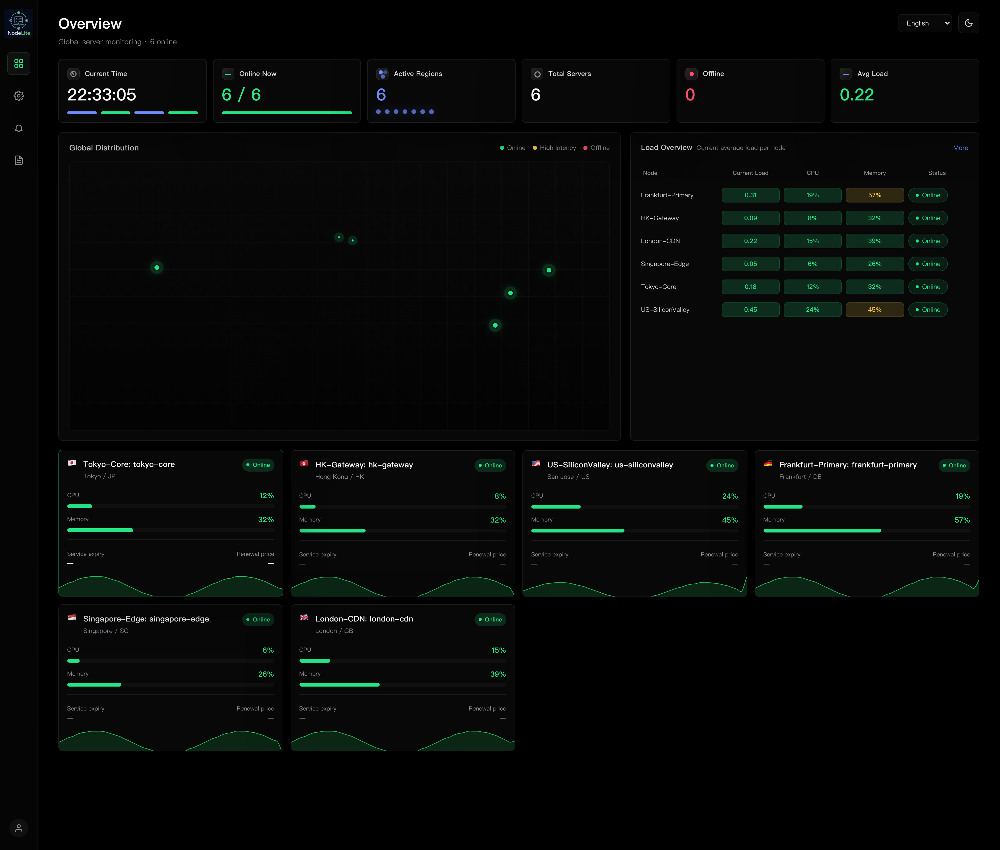
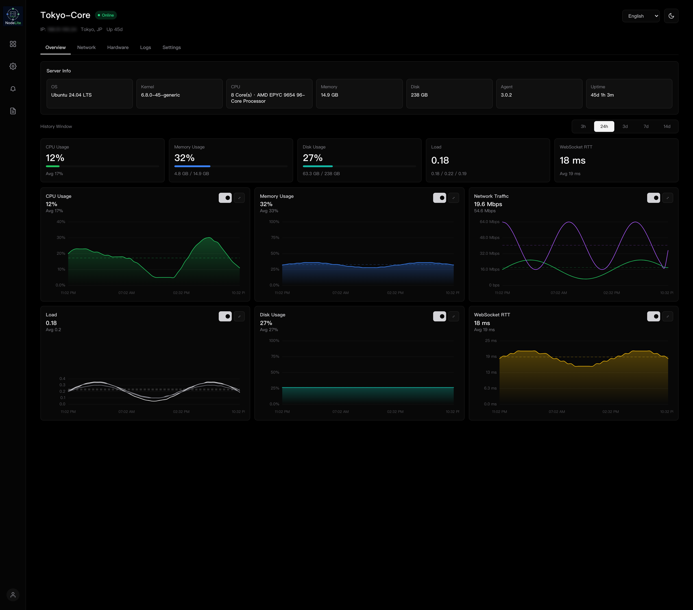

[**简体中文**](README.md) | [**English**](README.en.md)

[](https://github.com/XiNian-dada/NodeLite/actions/workflows/ci.yml)
[](https://github.com/XiNian-dada/NodeLite/actions/workflows/coverage.yml)
[](https://codecov.io/gh/XiNian-dada/NodeLite)
[](LICENSE)
[](Cargo.toml)

# NodeLite

**NodeLite** is a high-performance, ultra-lightweight server monitoring system written in Rust, utilizing a Server-Agent architecture.

Designed for **minimal resource footprint** (idle server memory < 15MB, agent < 2MB), **massive throughput & real-time streaming** (110k+ metrics/sec on 200 nodes, 3.75s 1,000-node fleet onboarding, 3.9ms warm reconnection), and **effortless deployment** (single static binary with embedded Vue 3 SPA).

📖 **Official Deployment Docs & Guide**: [https://xinian-dada.github.io/NodeLite/](https://xinian-dada.github.io/NodeLite/)

> [!TIP]
> **Version Recommendation**: Always use the latest official release from [GitHub Releases](https://github.com/XiNian-dada/NodeLite/releases) in production (e.g. `v3.0.x`).

---

## Table of Contents

- [✨ Features](#-features)
- [📸 Screenshots](#-screenshots)
- [⚡ 5-Minute Quickstart](#-5-minute-quickstart)
- [🏗️ System Architecture & Data Flow](#️-system-architecture--data-flow)
- [📊 Performance Benchmarks](#-performance-benchmarks)
- [⚙️ Core Configuration Cheat Sheet](#️-core-configuration-cheat-sheet)
- [🚨 Alerts & Linux Traffic Control](#-alerts--linux-traffic-control)
- [🔧 Operations & Upgrades](#-operations--upgrades)
- [❓ Troubleshooting FAQ](#-troubleshooting-faq)
- [💻 Developer & Build Guide](#-developer--build-guide)

---

## ✨ Features

* 🚀 **Ultra-low Footprint & Single Binary Delivery**:
  * Written in Rust with zero GC pause or hidden memory leakage;
  * Vue 3 + TypeScript single-page app (SPA) embedded directly inside the Rust Server binary;
  * Ready-to-run `musl` static binaries (`x86_64` and `aarch64`) with zero external dynamic runtime dependencies.
* ⚡ **Lock-Free Centralized Diff Broadcast**:
  * Employs a **Central Diff Engine** (1s debounce) that calculates incremental updates in a single background task and fans out to all browser WebSocket sessions without lock contention;
  * Reduces lock contention and Diff complexity from $O(M \times N)$ to $O(N)$.
* 🚦 **Native Linux Traffic Control (tc)**:
  * Integrates with the Linux kernel `tc` module. When a node reaches its monthly bandwidth quota, the Agent automatically throttles bandwidth to prevent costly overage fees.
* 🛡️ **Industrial-grade Security**:
  * Node tokens hashed with Argon2id under bounded concurrency slots (preventing OOM during reconnection storms);
  * Constant-time comparisons (`subtle::ConstantTimeEq`) across all token and credential verifications;
  * Web dashboard supports Basic Auth + **TOTP 2FA**, with Passkeys (Touch ID, Face ID, or device unlock) for routine second-factor verification;
  * Dedicated SQLite audit trail database (`audit.sqlite3`) logging authentication and security events.
* 🚨 **Comprehensive Alerting & Daily Inspections**:
  * Sliding-window rule evaluations for CPU, memory, latency, node offline, and monthly bandwidth;
  * Immediate dispatch via **SMTP Email** (StartTLS) and **Webhooks** (Telegram / Discord / Slack / Custom);
  * Daily 9:00 AM automated inspection report summarizing 24-hour fleet health.
* 📈 **Open Observability**:
  * Built-in Prometheus `/metrics` exposition endpoint with official Grafana dashboard templates;
  * Physical location inference via online ipwho.is or local MaxMind/DB-IP `.mmdb` files.

---

## 📸 Screenshots

<p align="center">
  
</p>

<p align="center">
  
</p>

---

## ⚡ 5-Minute Quickstart

### Step 1: Install Server

Run the installer on your control machine (Linux with systemd):

```bash
curl -fsSL https://github.com/XiNian-dada/NodeLite/releases/latest/download/install-server.sh | sudo sh
```

The script automatically detects CPU architecture, verifies SHA256 sums, generates config files, creates a systemd service, and starts `nodelite-server`.

### Step 2: Configure Reverse Proxy (TLS & WebSockets)

The server listens on `127.0.0.1:8080` by default. In production, use **Nginx** or **Caddy** to terminate TLS.

<details open>
<summary><b>Nginx Configuration (Recommended)</b></summary>

```nginx
server {
    listen 443 ssl http2;
    server_name monitor.example.com; # Replace with your domain

    ssl_certificate     /etc/letsencrypt/live/monitor.example.com/fullchain.pem;
    ssl_certificate_key /etc/letsencrypt/live/monitor.example.com/privkey.pem;

    # 1. Web UI and APIs
    location / {
        proxy_pass http://127.0.0.1:8080;
        proxy_http_version 1.1;
        proxy_set_header Host $host;
        proxy_set_header X-Real-IP $remote_addr;
        proxy_set_header X-Forwarded-For $proxy_add_x_forwarded_for;
        proxy_set_header X-Forwarded-Proto $scheme;
    }

    # 2. Agent and Browser WebSockets (Essential)
    location /ws {
        proxy_pass http://127.0.0.1:8080/ws;
        proxy_http_version 1.1;
        proxy_set_header Upgrade $http_upgrade;
        proxy_set_header Connection "upgrade";
        proxy_set_header Host $host;
        proxy_set_header X-Real-IP $remote_addr;
        proxy_set_header X-Forwarded-For $proxy_add_x_forwarded_for;
        proxy_set_header X-Forwarded-Proto $scheme;
        proxy_read_timeout 120s;
        proxy_send_timeout 120s;
    }

    # 3. Agent install scripts
    location /install/ {
        proxy_pass http://127.0.0.1:8080;
        proxy_http_version 1.1;
        proxy_set_header Host $host;
        proxy_set_header X-Real-IP $remote_addr;
        proxy_set_header X-Forwarded-For $proxy_add_x_forwarded_for;
        proxy_set_header X-Forwarded-Proto $scheme;
    }
}
```
</details>

<details>
<summary><b>Local Testing Mode (HTTP direct, no domain)</b></summary>

For local or test lab verification, edit `/opt/nodelite/config/server.toml`:
```toml
[server]
listen = "0.0.0.0:8080"
public_base_url = "http://192.168.1.100:8080"
insecure_allow_http = true
```
Restart the service to access directly via `http://192.168.1.100:8080/`.
</details>

### Step 3: Issue and Deploy Agent

Issue an installation command with a one-time token (valid for 15 minutes) on the server:

```bash
/usr/local/bin/nodelite-server \
  --config /opt/nodelite/config/server.toml \
  install-agent \
  --node-id hk-01 \
  --node-label "Hong Kong 01"
```

Copy the generated `curl ... | sh` command and run it on your target node (Linux / macOS). The node will connect and appear on the dashboard within 2 seconds.

---

## 🏗️ System Architecture & Data Flow

```text
[ NodeLite Agent ]  ---(WSS: Metrics / Heartbeat)---> [ Nginx / Caddy Proxy ]
                                                             │
                                                  (127.0.0.1:8080)
                                                             ▼
                                               [ nodelite-server Gateway ]
                                                 ├── Admission & Argon2id Auth
                                                 ├── SharedState Central Diff (1s)
                                                 ├── Batch Writer -> history.sqlite3
                                                 └── Alert Runtime (SMTP / Webhook)
                                                             │
                                         ┌───────────────────┴───────────────────┐
                                         ▼                                       ▼
                             [ Web Dashboard (Vue 3) ]                 [ Prometheus /metrics ]
                             (Incremental Diff DOM)                   (Grafana Dashboard)
```

---

## 📊 Performance Benchmarks

> Measured on dedicated Linux x86_64 host (Ubuntu kernel 6.8.0, 12 vCPUs / 16 GB RAM), Rust 1.98 (Profile: `release` with LTO), standard network loopback with full TLS/WSS authentication pipeline.

### 1. Scaling Benchmark

Scaling from 20 to 200 nodes under concurrent metric bursts and API reads:

| Node Count | Connection Time | Burst Metrics Total | Steady Throughput | Overview API p95 |
| :---: | :---: | :---: | :---: | :---: |
| **20** | 84.7 ms | 240 | 11,273 metrics/s | 26.03 ms |
| **50** | 210.5 ms | 600 | 29,255 metrics/s | 30.76 ms |
| **100** | 375.7 ms | 1,200 | 18,662 metrics/s | 27.21 ms |
| **200** | 757.9 ms | 2,400 | **110,970 metrics/s** | **24.61 ms** |

* At 200 concurrent nodes, processing throughput exceeds **110,000 metrics/sec**, while Overview API p95 latency stays at ~25ms and total fleet connection takes only 758ms.

### 2. Large Fleet Stress Test (500 to 1,000 Nodes)

Simulating high-density fleet monitoring:

| Node Count | Connection Time | Steady Throughput | API p95 Latency (Overview / Nodes / Prometheus) | Server Memory (RSS) | SQLite Storage Drops |
| :---: | :---: | :---: | :---: | :---: | :---: |
| **500 nodes** | 2.33 s | 46,603 metrics/s | 36.08 ms / 312.85 ms / 44.75 ms | ~488 MB (< 1 MB / node) | **0 (zero drops)** |
| **1,000 nodes** | 3.75 s | **67,480 metrics/s** | 35.37 ms / 38.14 ms / 85.24 ms | ~514 MB (~514 KB / node) | **0 (zero drops)** |

* **Ultra-fast Fleet Handshake**: 1,000 nodes establish secure WebSocket sessions and admission validation in just 3.75 seconds.
* **Minimal Memory Footprint**: Entire 1,000-node fleet server RSS is ~514 MB, averaging only ~514 KB per monitored server.
* **Lossless History Storage**: SQLite asynchronous batch writer maintains a 0 queue depth with zero dropped metrics under high write pressure.

### 3. Reconnect Storm & Session Caching

Simulating 200 nodes disconnecting and reconnecting across 4 cycles (800 connection sessions total):

* **Token Cache Hit Rate**: **75.00%** (200 initial verifications, 600 cache hits, 0 evictions);
* **Warm Reconnection Latency**: **3.92 ms** (median p50 connection latency: **4.23 ms**);
* **Fleet State Transition**: Node disconnect cleanup median latency is 21.50 ms; recovery median latency is 86.00 ms.

### 4. Concurrent Dashboard Readers (1,000 Nodes + 20 Readers)

Simulating 20 concurrent dashboard operators actively refreshing views under a 1,000-node fleet:

* **View Cache Hit Rate**: Overview endpoint achieved **96.25%** hit rate (77/80); Nodes list endpoint achieved **98.75%** hit rate (79/80).
* **Throughput & Persistence**: Cluster throughput sustained **72,211 metrics/sec** with zero history write drops.

---

## ⚙️ Core Configuration Cheat Sheet

Server configuration file: `/opt/nodelite/config/server.toml`:

| Section | Parameter | Default / Recommended | Description |
| :--- | :--- | :--- | :--- |
| `[server]` | `listen` | `"127.0.0.1:8080"` | Internal listen address |
| `[server]` | `public_base_url` | `"https://monitor.example.com"` | Base URL used to derive WSS and install URLs |
| `[server]` | `stale_after_secs` | `20` | Mark node offline after missing heartbeats |
| `[server]` | `token_verify_max_parallelism` | `4` | Max parallel Argon2id workers (prevents OOM spikes) |
| `[auth]` | `username` / `password` | Generated strong pass | Readonly Basic Auth credentials |
| `[auth]` | `enable_2fa` | `false` | Enable second-factor verification; TOTP and Passkeys can then be enrolled |
| `[audit]` | `enabled` / `retention_days`| `true` / `90` | Audit trail SQLite retention |
| `[geoip]` | `provider` | `"ipwhois"` | Location source: `"ipwhois"` (online) / `"dbip"` (local MMDB) |

---

### Passkeys (a convenient second-factor alternative)

Enable 2FA and enrol TOTP from the Account page before adding a Passkey. Later sign-ins can use Touch ID, Face ID, or the device screen lock, while TOTP remains available for recovery. Passkeys require an `https://` `server.public_base_url` and a browser with WebAuthn support.

Registered public credentials live in `passkeys.json` beside `server.toml` with `0600` permissions and are preserved by the built-in server-upgrade backup. Do not edit that file manually. If every verification device is lost, temporarily disable 2FA using the recovery procedure below, then enrol new factors.

---

## 🚨 Alerts & Linux Traffic Control

### 1. Alerting (SMTP & Webhooks)

```toml
[alerts]
enabled = true

[alerts.smtp]
enabled = true
host = "smtp.example.com"
port = 587
username = "alert@example.com"
password = "your-smtp-password"
sender = "alert@example.com"
recipients = ["admin@example.com"]
send_resolved = true

[alerts.webhook]
enabled = true
url = "https://api.telegram.org/bot<TOKEN>/sendMessage?chat_id=<CHAT_ID>"
send_resolved = true

[alerts.inspection]
enabled = true
local_time = "09:00"
delivery = ["smtp", "webhook"]
```

### 2. Linux Agent Traffic Control (tc)

To enable kernel-level bandwidth throttling on Linux nodes, pass `--enable-traffic-control` when installing or upgrading:

```bash
curl -fsSL https://monitor.example.com/install/install-agent.sh | \
  NODELITE_AGENT_INSTALL_TOKEN='...' sh -s -- \
  --enable-traffic-control
```

* **Least Privilege**: Runs as non-root `nodelite-agent` user with `CAP_NET_ADMIN` and `AF_NETLINK` within systemd sandbox;
* **Automatic Enforcement**: When monthly quota is exceeded, bandwidth is limited automatically, and alerts are dispatched.

---

## 🔧 Operations & Upgrades

### Status Checks

```bash
# Server status & logs
sudo systemctl status nodelite-server.service
sudo journalctl -u nodelite-server.service -f

# Agent status & logs
sudo systemctl status nodelite-agent.service
sudo journalctl -u nodelite-agent.service -f
```

### Upgrading

* **Upgrade Server** (automatically backs up database and restores on error):
  ```bash
  curl -fsSL https://github.com/XiNian-dada/NodeLite/releases/latest/download/install-server.sh | \
    sudo NODELITE_SERVER_MODE=upgrade sh
  ```
* **Generate Agent Upgrade Commands**:
  ```bash
  /usr/local/bin/nodelite-server --config /opt/nodelite/config/server.toml upgrade-agent
  ```

### Password Reset & 2FA Recovery

Edit `/opt/nodelite/config/server.toml` directly:
```toml
[auth]
password = "NewStrongPassword@2026"
enable_2fa = false # Set false to disable 2FA if device is lost
```
Then restart the server:
```bash
sudo systemctl restart nodelite-server.service
```

---

## ❓ Troubleshooting FAQ

- **Dashboard opens but no nodes appear?**
  - Check agent logs: `sudo journalctl -u nodelite-agent -n 50 --no-pager`;
  - Verify that reverse proxy forwards `Upgrade` and `Connection "upgrade"` WebSocket headers.
- **Node install says `invalid install token`?**
  - Tokens expire after 15 minutes. Re-issue with `install-agent` on the server.
- **Agent blocked by `/ws` rate limiter?**
  - If behind a remote proxy or CDN WAF, add the proxy CIDR to `trusted_proxies` in `server.toml`.
- **Prometheus Scrape Config?**
  - `/metrics` shares Basic Auth with the dashboard. See [`ops/prometheus/prometheus.yml`](ops/prometheus/prometheus.yml).

---

## 💻 Developer & Build Guide

```bash
# Check and run tests
cargo check
cargo test --workspace
cargo clippy --all-targets -- -D warnings

# Benchmarks (scaling, reconnect, large fleet, dashboard fanout)
# Ensure ulimit -n >= 65536 before running large fleet benchmarks
cargo bench -p nodelite-server --features bench-internals --bench load -- scaling
cargo bench -p nodelite-server --features bench-internals --bench load -- reconnect
cargo bench -p nodelite-server --features bench-internals --bench load -- large-fleet
cargo bench -p nodelite-server --features bench-internals --bench load -- dashboard
cargo bench -p nodelite-server --features bench-internals --bench load -- history-pressure

# Build Linux static musl binaries
cargo build --release --target x86_64-unknown-linux-musl -p nodelite-server -p nodelite-agent
cargo build --release --target aarch64-unknown-linux-musl -p nodelite-server -p nodelite-agent

# Fuzzing
cargo test --manifest-path fuzz/Cargo.toml
cargo run --manifest-path fuzz/Cargo.toml --bin protocol_messages -- 10000
```

---

## License

NodeLite is released under the [MIT License](LICENSE).
